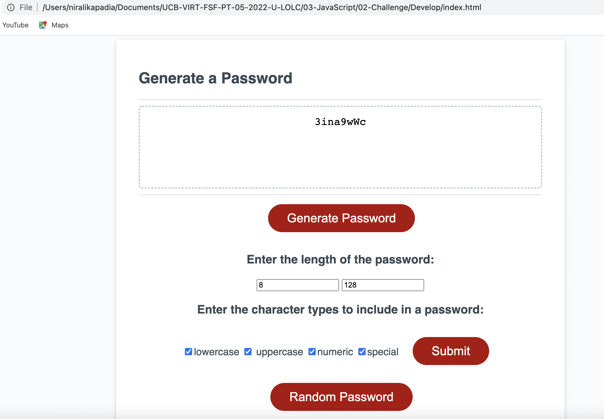

# challenge-jul-05 (Random Password Generator)

##Description

In this challenge, I have developed a random password generator. This website has html, css and Java script files/codes that do the following:

- I have created a password criteria form in 'Index.html' file. This form is hidden and is only made visible when the customer double clicks on the 'Generate' button. 

- On the click of the 'Generate' button, the hidden form for the password criteria is made visible and the user is forced to first enter the password criteria.

- The password criteria checks the minimum password length to be atleast 8 characters and the maximum password criteria to be no more than 128. It also checks that both the field values are between 8 to 128. It gives a error message to the user if the conditions are not met.

- The password criteria form also checks if atleast one of the four checkboxes for the chracter types (lowercase, uppercase, numeric, special) are selected. It gives a error message to the user if the none of the checkboxes are selected.

- The user selection is validated with the click of the 'Submit' button.

- If the user meets the selection criteria successfully, then the user is asked to click on the 'Random Password' button to generate the random password. The 'Random Password' button only becomes visible if the user successfully meets the selection criteria.

-On the click on the 'Random Password', the user sees a random password displayed in the 'Your secure password' text box. The random password generated always meets the user selection criteria of the length and the type of characters selected.

